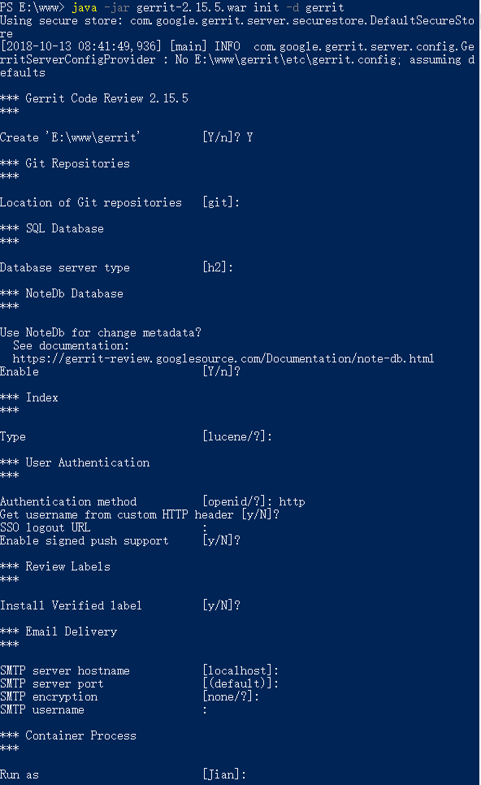
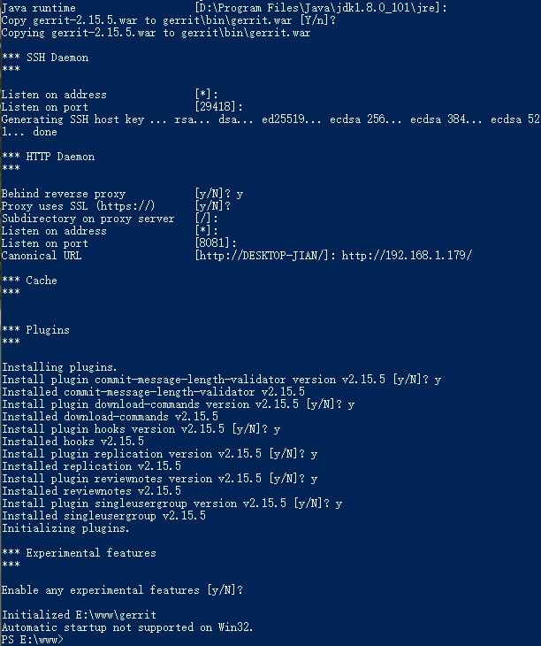
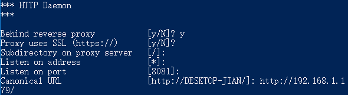
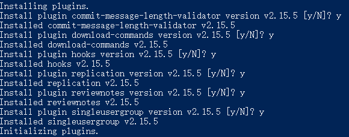
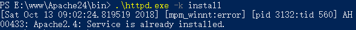

# How to install Gerrit on Windows
>The guide show how to install gerrit on the Windows OS.  
>**Since my OS is 64bit, so if yours is 32bit, please download the softwares in right version.**

## Prepare
OS: Windows 10 pro  
Download bellow Softwares:  
* [Git-2.19.1-64-bit.exe](https://git-scm.com/downloads)  
* [gerrit-2.15.5.war](https://gerrit-releases.storage.googleapis.com/gerrit-2.15.5.war) Maybe Chinese cannot access this websites directly.   
* [httpd-2.4.27-Win64-VC15.zip](https://www.apachelounge.com/download/VC15/binaries/httpd-2.4.27-Win64-VC15.zip) Apache httpd needs install [the latest C++ Redistributable Visual Studio 2017](https://go.microsoft.com/fwlink/?LinkId=746572).  
**When you met the C++ Redistributable cannot setup issue, you should run the System update first, then you can install it successfully.**  

## Setup  
Please create a folder ```git``` in hard drive.  
Like ```E:/git```, bellow content based on this example.  
**1. install git tool**  
Install it into ```E:/git/Git```  
  
   
   
Then leave the defaults setting and intall it.
  
**2. Install gerrit**  
Move **gerrit-2.15.5.war** into ```E:/www/```  
Please create a folder 'gerrit' in hard drive.
Like ```E:\wwww\gerrit\``` on this example.
Press ```left-shift + Right Click``` to open the PowerShell in current folder.  
Run bellow command: ```java -jar gerrit-2.15.5.war init -d gerrit```   
   
   

需要注意的选择：


Select `y` if you need Apache or Nginx proxy:
 

Select `y` to install all plugins:
 

Then many folders will extract and it will generate ```etc/gerrit.config```.   
Content as follows:  
<pre>
[gerrit]
	basePath = git
	serverId = d52f9a1e-ff97-47b0-814e-a527dae2c121
	canonicalWebUrl = http://192.168.1.179:4000/
[database]
	type = h2
	database = E:\\www\\gerrit\\db\\ReviewDB
[noteDb "changes"]
	disableReviewDb = true
	primaryStorage = note db
	read = true
	sequence = true
	write = true
[index]
	type = LUCENE
[auth]
	type = HTTP
[receive]
	enableSignedPush = false
[sendemail]
	smtpServer = localhost
[container]
	user = Jian
	javaHome = D:\\Program Files\\Java\\jdk1.8.0_101\\jre
[sshd]
	listenAddress = *:29418
[httpd]
	listenUrl = proxy-http://*:8081/
[cache]
	directory = cache
</pre>

**3. Install httpd**  
Extract **httpd-2.4.27-Win64-VC15.zip** to ```E:/www/Apache24/```.  
Install ```the latest C++ Redistributable Visual Studio 2017```. 
Enter into ```E:/www/Apache24/bin/```, then open PowerShell in this current path.  
Modify ```conf/httpd.conf``` file as follows:  
<pre>
 SRVROOT "E:/www/Apache24"

Listen 4000

# These lines need to be added or uncomment
LoadModule proxy_module modules/mod_proxy.so
LoadModule proxy_balancer_module modules/mod_proxy_balancer.so
LoadModule proxy_connect_module modules/mod_proxy_connect.so
LoadModule proxy_ftp_module modules/mod_proxy_ftp.so
LoadModule proxy_http_module modules/mod_proxy_http.so
LoadModule rewrite_module modules/mod_rewrite.so
LoadModule slotmem_shm_module modules/mod_slotmem_shm.so
LoadModule socache_shmcb_module modules/mod_socache_shmcb.so
LoadModule ssl_module modules/mod_ssl.so


</pre>  
Execute bellow command: ```httpd.exe -k isntall```.  
It will show bellow message when installed successfully.  
  
Then add gerrit reference things in ```conf/httpd.conf```:  

```
<VirtualHost *:4000>  
    ServerName 192.168.1.179
    
    ProxyRequests Off
    ProxyVia Off
    ProxyPreserveHost On
    
    <Proxy *> 
        Order deny,allow  
        Allow from all  
    </Proxy>
    
    <Location /login/>  
        AuthType Basic  
        AuthName "Welcome to Gerrit Code Review!"  
        Require valid-user  
        AuthBasicProvider file  
        AuthUserFile E:/www/gerrit/gerrit_password
    </Location> 
 
    AllowEncodedSlashes On  
    ProxyPass / http://192.168.1.179:8081/
</VirtualHost>
```

**4. Create gerrit_password**  
Execute the command in the command line: ```E:\www\Apache24\bin\htpasswd.exe -c -b E:/www/gerrit/gerrit_password USER PASSWORD```  
It will create the user/password file ```gerrit_password``` into **E:/www/gerrit/**.
创建第一个用户后，要想添加更多用户，需要去掉`-c` ```E:\www\Apache24\bin\htpasswd.exe -b E:/www/gerrit/gerrit_password USER PASSWORD```

## Start Service
**1. start gerrit**  
Go to directory `E:\www\gerrit\bin`, right click, selec **Git bash here**
Execute the command into git bash: ```./gerrit.sh restart```.
You can find the log "**Starting Gerrit Code Review: OK**" at Git-Bash window.  
Or you can check the ```logs``` folder, there is a **gerrit.run** file.

**2. start httpd**  
Execute the command into PowerShell run as Administor: ```E:\www\Apache24\bin\httpd.exe -k restart```.  
Or you can execute ```bin/ApacheMonitor.exe``` to start the service.

## Verify
You can input ```http://192.168.1.179:4000/``` into your browser.  
If OK, you will see bellow picture:  

 

## Install the daemon as Windows Service

prunsrv.exe: [commons-daemon-1.1.0-bin-windows.zip](http://www.apache.org/dist/commons/daemon/binaries/windows/commons-daemon-1.1.0-bin-windows.zip)

Use the amd64 version if your system is 64.

Install service by run this command:

```
prunsrv.exe //IS//Gerrit --DisplayName="Gerrit Code Review" --Startup=auto ^
      --Jvm="D:\Program Files\Java\jdk1.8.0_101\jre\bin\server\jvm.dll" ^
      --Classpath=E:\www\gerrit\bin\gerrit.war ^
      --LogPath=E:\www\gerrit\logs ^
      --StartPath=E:\www\gerrit ^
      --StartMode=jvm --StopMode=jvm ^
      --StartClass=com.google.gerrit.launcher.GerritLauncher --StartMethod=daemonStart ^
      --StopClass=com.google.gerrit.launcher.GerritLauncher --StopMethod=daemonStop ^
```

## Email config

```
[oauth]
    allowEditFullName = true
    allowRegisterNewEmail = true
[sendemail]
	smtpServer = smtp.qiye.aliyun.com
	smtpServerPort = 465
	smtpEncryption = ssl
	sslVerify = true
	smtpUser = user@hantek.com
	smtpPass = password
	from=CodeReview<user@hantek.com>
```

It seems `from=CodeReview<user@hantek.com>` must be added.